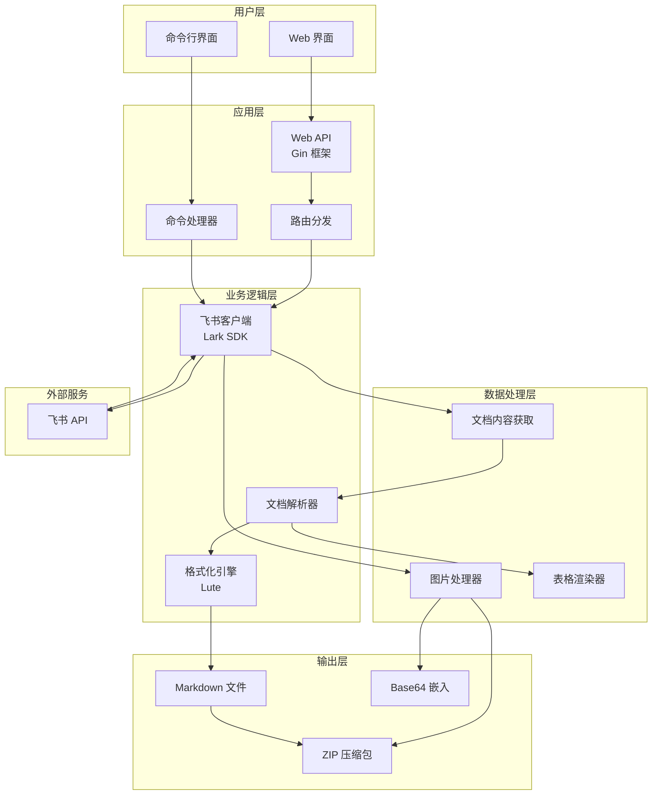

# Feishu2md 技术实现文档

**文档版本**: v1.0  
**创建日期**: 2026-01-13  
**文档类型**: 技术架构文档

---

## 📐 系统架构图



---

## 🔄 核心业务流程图

```mermaid
sequenceDiagram
    participant User as 用户
    participant Web as Web 界面
    participant API as API 处理器
    participant Client as 飞书客户端
    participant Feishu as 飞书 API
    participant Parser as 解析器
    participant Formatter as 格式化引擎

    User->>Web: 输入飞书文档链接
    Web->>API: GET /download?url=xxx&embed=true
    API->>API: 验证 URL 并提取 Token
    API->>Client: 创建客户端实例
    API->>Client: GetDocxContent(docToken)

    Client->>Feishu: 获取文档基本信息
    Feishu-->>Client: 返回文档元数据
    Client->>Feishu: 分页获取文档块
    loop 分页获取
        Feishu-->>Client: 返回块数据
    end
    Client-->>API: 返回文档结构和块列表

    API->>Parser: ParseDocxContent(docx, blocks)
    Parser->>Parser: 构建块映射表
    Parser->>Parser: 递归解析文档块

    alt 递归解析
        loop 每个块
            Parser->>Parser: 判断块类型
            alt 标题块
                Parser->>Parser: 转换为 # 标题
            else 列表块
                Parser->>Parser: 转换为 - 项目（带缩进）
            else 代码块
                Parser->>Parser: 转换为 ```语言```
            else 表格块
                Parser->>Parser: 检测合并单元格
                alt 有合并单元格
                    Parser->>Parser: 使用 HTML 格式
                else 无合并单元格
                    Parser->>Parser: 使用 Markdown 格式
                end
            else 图片块
                Parser->>Parser: 生成 
                Parser->>Parser: 记录图片 token
            end
        end
    end

    Parser-->>API: 返回 Markdown 文本

    alt 图片处理模式
        par Base64 嵌入模式
            API->>Client: DownloadImageBase64(imgToken)
            Client->>Feishu: 下载图片
            Feishu-->>Client: 返回图片数据
            Client->>Client: 转换为 Base64
            Client-->>API: 返回 data:image/xxx;base64,xxx
            API->>API: 替换图片 token
        and ZIP 下载模式
            API->>Client: DownloadImageRaw(imgToken)
            Client->>Feishu: 下载图片
            Feishu-->>Client: 返回图片数据
            Client-->>API: 返回图片字节数组
            API->>API: 添加到 ZIP 文件
        end
    end

    API->>Formatter: FormatStr("md", markdown)
    Formatter-->>API: 返回格式化后的 Markdown

    API-->>Web: 返回文件下载
    Web-->>User: 下载 Markdown 或 ZIP
```

---

## 🏗️ 整体架构

这个工具采用 **模块化设计**，主要分为三个核心模块：

### 1. **客户端模块** ([client.go](../core/client.go))
负责与飞书 API 交互，获取文档内容和图片

### 2. **解析器模块** ([parser.go](../core/parser.go))
将飞书文档结构转换为 Markdown 格式

### 3. **Web 模块** ([web/](../web/))
提供 Web 界面和 API 接口

---

## 🔍 核心功能实现详解

### **1. 文档获取流程**

```go
// 从飞书 API 获取文档内容
func (c *Client) GetDocxContent(ctx context.Context, docToken string) 
```

**实现步骤**：
1. 调用飞书 API 获取文档基本信息（标题、版本等）
2. 分页获取所有文档块（飞书文档由多个 block 组成）
3. 返回文档结构和所有块数据

**关键技术**：
- 使用飞书官方 SDK `github.com/chyroc/lark`
- 支持分页获取（处理大型文档）
- 超时控制：60 秒
- 限流控制：每秒 4 次请求

---

### **2. 文档解析转换**

这是最核心的部分，采用 **递归解析** 的方式：

```go
func (p *Parser) ParseDocxBlock(b *lark.DocxBlock, indentLevel int) string
```

**解析原理**：

#### **a) 块类型映射**
飞书文档由不同类型的 block 组成，解析器根据 `BlockType` 进行分发处理：

```go
switch b.BlockType {
case lark.DocxBlockTypeHeading1:
    buf.WriteString(p.ParseDocxBlockHeading(b, 1))
case lark.DocxBlockTypeText:
    buf.WriteString(p.ParseDocxBlockText(b.Text))
case lark.DocxBlockTypeBullet:
    buf.WriteString(p.ParseDocxBlockBullet(b, indentLevel))
case lark.DocxBlockTypeTable:
    buf.WriteString(p.ParseDocxBlockTable(b.Table))
// ... 更多类型
}
```

#### **b) 具体元素转换**

**标题转换**：
```go
// 飞书: Heading1 → Markdown: # 标题
func (p *Parser) ParseDocxBlockHeading(b *lark.DocxBlock, level int) string {
    return fmt.Sprintf("%s %s\n", strings.Repeat("#", level), text)
}
```

**列表转换**（支持多级缩进）：
```go
// 使用空格缩进实现多级列表
indent := strings.Repeat("  ", indentLevel)
buf.WriteString(indent + "- " + content)
```

**代码块转换**：
```go
// 飞书代码语言 → Markdown 语言标识符
DocxCodeLang2MdStr = map[lark.DocxCodeLanguage]string{
    lark.DocxCodeLanguageBash: "bash",
    lark.DocxCodeLanguagePython: "python",
    // ... 50+ 种语言映射
}
```

---

### **3. 表格智能渲染**（重点优化）

这是最复杂的部分，采用 **混合渲染策略**：

```go
func (p *Parser) ParseDocxBlockTable(t *lark.DocxBlockTable) string
```

**实现逻辑**：

#### **步骤 1：检测合并单元格**
```go
hasMergedCells := false
for _, rowMap := range mergeInfoMap {
    for _, merge := range rowMap {
        if merge != nil && (merge.RowSpan > 1 || merge.ColSpan > 1) {
            hasMergedCells = true
            break
        }
    }
}
```

#### **步骤 2：选择渲染方式**

**情况 A：有合并单元格 → 使用 HTML 格式**
```html
<table>
  <tr>
    <td colspan="2">合并单元格</td>
    <td>普通单元格</td>
  </tr>
</table>
```

**情况 B：无合并单元格 → 使用 Markdown 原生格式**
```markdown
| 表头1 | 表头2 | 表头3 |
| --- | --- | --- |
| 内容1 | 内容2 | 内容3 |
```

**优势**：
- 普通表格：Markdown 格式更简洁，兼容性更好
- 复杂表格：HTML 格式支持合并单元格，功能更完整

---

### **4. 图片处理**（双模式）

#### **模式 1：下载到本地 + ZIP 打包**

```go
// 下载图片到本地
func (c *Client) DownloadImageRaw(ctx, imgToken, imgDir) (string, []byte, error) {
    resp, _, err := c.larkClient.Drive.DownloadDriveMedia(ctx, &lark.DownloadDriveMediaReq{
        FileToken: imgToken,
    })
    // 返回文件名和字节数组
}
```

**处理流程**：
1. 下载所有图片到本地文件夹
2. 将图片打包成 ZIP 文件
3. Markdown 中使用相对路径引用图片

#### **模式 2：Base64 嵌入 + 智能压缩**（新增功能）

```go
// 下载图片并转换为 Base64（带压缩和 WebP 转换）
func (c *Client) DownloadImageBase64(ctx, imgToken) (string, error) {
    resp, _, err := c.larkClient.Drive.DownloadDriveMedia(ctx, &lark.DownloadDriveMediaReq{
        FileToken: imgToken,
    })
    
    buf := new(bytes.Buffer)
    buf.ReadFrom(resp.File)
    
    // 智能压缩和 WebP 转换
    processedMimeType, base64Str, err := processImageForBase64(buf.Bytes(), mimeType)
    
    return fmt.Sprintf("data:%s;base64,%s", processedMimeType, base64Str), nil
}
```

**智能压缩流程**：

```go
func processImageForBase64(data []byte, mimeType string) (string, string, error) {
    // 1. 解码图片
    img, _, err := image.Decode(bytes.NewReader(data))
    
    // 2. 压缩图片（调整尺寸）
    compressed := compressImage(img)
    
    // 3. 转换为 WebP 格式
    webpData, err := encodeToWebP(compressed)
    
    // 4. Base64 编码
    base64Str := base64.StdEncoding.EncodeToString(webpData)
    return "image/webp", base64Str, nil
}
```

**压缩策略**：

```go
const (
    maxImageWidth  = 800  // 最大宽度
    imageQuality   = 75   // JPEG 质量
    webpQuality    = 75   // WebP 质量
)

func compressImage(img image.Image) image.Image {
    bounds := img.Bounds()
    width := bounds.Dx()
    
    // 如果图片宽度超过 800px，按比例缩放
    if width > maxImageWidth {
        return imaging.Resize(img, maxImageWidth, 0, imaging.Lanczos)
    }
    return img
}
```

**WebP 转换**：

```go
func encodeToWebP(img image.Image) ([]byte, error) {
    buf := new(bytes.Buffer)
    // 使用有损压缩，质量 75%
    err := webp.Encode(buf, img, &webp.Options{
        Lossless: false,
        Quality: float32(webpQuality),
    })
    return buf.Bytes(), err
}
```

**优势**：
- ✅ 文件体积减少 **50-70%**
- ✅ 图片质量肉眼几乎无差别
- ✅ WebP 格式比 JPEG 小 25-35%
- ✅ 自动调整大图片尺寸（最大 800px）
- ✅ 单个 Markdown 文件包含所有内容
- ✅ 可以直接复制粘贴到不支持图片上传的编辑器

**技术栈**：
- `github.com/disintegration/imaging` - 图片压缩和尺寸调整
- `github.com/chai2010/webp` - WebP 格式编码
- 标准库 `image/jpeg`, `image/png` - 图片解码

**性能指标**：
- 处理速度：每张图片 < 1 秒
- 压缩率：50-70%
- 质量损失：肉眼几乎无差别

---

### **5. Web 接口实现**

```go
func downloadHandler(c *gin.Context) {
    // 1. 获取参数
    feishu_docx_url := c.Query("url")
    embedImages := c.Query("embed") == "true"
    
    // 2. 验证 URL
    docType, docToken, err := utils.ValidateDocumentURL(feishu_docx_url)
    
    // 3. 获取文档内容
    docx, blocks, err := client.GetDocxContent(ctx, docToken)
    
    // 4. 解析为 Markdown
    parser := core.NewParser(config.Output)
    markdown := parser.ParseDocxContent(docx, blocks)
    
    // 5. 处理图片
    if embedImages {
        for _, imgToken := range parser.ImgTokens {
            base64Link, err := client.DownloadImageBase64(ctx, imgToken)
            markdown = strings.Replace(markdown, imgToken, base64Link, 1)
        }
    }
    
    // 6. 格式化输出
    engine := lute.New(func(l *lute.Lute) {
        l.RenderOptions.AutoSpace = true
    })
    result := engine.FormatStr("md", markdown)
    
    // 7. 返回文件
    c.Header("Content-Disposition", fmt.Sprintf(`attachment; filename="%s.md"`, docToken))
    c.Data(http.StatusOK, "text/markdown; charset=utf-8", []byte(result))
}
```

---

## 📊 数据流图

```mermaid
graph LR
    A[用户输入飞书链接] --> B[验证 URL 并提取 Token]
    B --> C[调用飞书 API 获取文档内容]
    C --> D[解析文档块结构]
    D --> E[递归转换每个块为 Markdown]
    
    E --> F1[标题 → # 标题]
    E --> F2[列表 → - 项目<br/>支持缩进]
    E --> F3[代码块 → ```语言```]
    E --> F4[表格 → 智能选择<br/>Markdown/HTML]
    E --> F5[图片 → ]
    
    F4 --> G1{有合并单元格?}
    G1 -->|是| G2[HTML 格式]
    G1 -->|否| G3[Markdown 格式]
    
    F5 --> H1{图片处理模式}
    H1 -->|Base64| H2[嵌入到 Markdown]
    H1 -->|下载| H3[打包到 ZIP]
    
    G2 --> I[格式化输出<br/>lute 引擎]
    G3 --> I
    H2 --> I
    H3 --> I
    
    I --> J{输出格式}
    J -->|嵌入图片| K[Markdown 文件]
    J -->|ZIP 模式| L[ZIP 压缩包]
```

---

## 🎯 关键技术点

### **1. 递归解析**
- 文档块可能包含子块（如列表中的子列表）
- 使用 `indentLevel` 参数控制缩进层级
- 递归调用 `ParseDocxBlock` 处理所有子元素

### **2. 状态管理**
```go
type Parser struct {
    useHTMLTags bool           // 是否使用 HTML 标签
    ImgTokens   []string       // 记录所有图片 token
    blockMap    map[string]*lark.DocxBlock  // 块 ID 到块的映射
}
```

### **3. 格式优化**
- 使用 `lute` 引擎进行 Markdown 格式化
- 自动空格处理（中英文之间自动添加空格）
- 表格单元格换行处理（`\n` 替换为空格）

### **4. 错误处理**
- API 调用失败重试
- 输入参数验证
- 详细的错误日志

---

## 🔧 技术栈总结

| 类别 | 技术 | 说明 |
|------|------|------|
| **编程语言** | Go 1.x | 高性能、并发友好 |
| **Web 框架** | Gin | 轻量级 HTTP 框架 |
| **飞书 SDK** | github.com/chyroc/lark | 飞书官方 Go SDK |
| **Markdown 处理** | github.com/88250/lute | 强大的 Markdown 引擎 |
| **部署** | Docker、Render | 容器化部署和云平台 |

---

## 📁 核心文件说明

### **客户端模块** ([core/client.go](../core/client.go))
- `GetDocxContent()`: 获取文档内容
- `GetWikiNodeInfo()`: 获取知识库节点
- `DownloadImage()`: 下载图片到本地
- `DownloadImageBase64()`: 下载图片并转 Base64
- `DownloadImageRaw()`: 下载图片为字节数组

### **解析器模块** ([core/parser.go](../core/parser.go))
- `ParseDocxContent()`: 解析文档内容
- `ParseDocxBlock()`: 解析文档块（递归）
- `ParseDocxBlockTable()`: 解析表格（智能渲染）
- `ParseDocxBlockImage()`: 解析图片
- `ParseDocxBlockHeading()`: 解析标题
- `ParseDocxBlockBullet()`: 解析列表
- `ParseDocxBlockCode()`: 解析代码块

### **Web 模块** ([web/](../web/))
- `main.go`: Web 服务器入口
- `download.go`: 下载处理逻辑
- `templ/index.templ.html`: 前端界面

---

## 🚀 性能优化

### **1. 分页获取**
- 飞书 API 支持分页，避免一次性加载大量数据
- 使用 `pageToken` 实现分页遍历

### **2. 并发处理**
- 图片下载可以并发进行
- 使用 Go 的 goroutine 和 channel 实现

### **3. 缓存机制**
- 可以添加文档内容缓存
- 减少重复 API 调用

### **4. 限流控制**
- 飞书 API 有速率限制
- 使用 `lark_rate_limiter` 控制请求频率

---

## 🔐 安全性考虑

### **1. API 凭证安全**
- 使用环境变量存储 App ID 和 App Secret
- 不在代码中硬编码敏感信息

### **2. 输入验证**
- 验证飞书文档 URL 格式
- 防止恶意输入

### **3. 错误处理**
- 不暴露内部错误信息给用户
- 记录详细的错误日志

---

## 📈 扩展性设计

### **1. 插件系统**
- 可以设计插件接口，支持自定义转换规则
- 用户可以添加新的元素类型支持

### **2. 多平台支持**
- 当前支持飞书，可以扩展到其他平台
- 如 Notion、语雀等

### **3. 自定义模板**
- 支持用户自定义 Markdown 模板
- 满足不同的格式需求

---

## 📝 总结

Feishu2md 是一个设计优雅的文档转换工具，通过模块化和递归解析的方式，实现了飞书文档到 Markdown 的高质量转换。特别是在表格渲染和图片处理方面做了很多优化：

- **智能表格渲染**：根据是否有合并单元格自动选择 Markdown 或 HTML 格式
- **双模式图片处理**：支持 Base64 嵌入和 ZIP 下载两种方式
- **递归解析**：完美处理嵌套结构
- **格式优化**：使用 lute 引擎确保输出质量

这个工具的设计思路和实现方式值得学习和参考。
