# 飞书文档转换工具 - 部署架构文档

> 本文档详细说明了 feishu2md 项目的部署架构、组件关系和请求处理流程

---

## 📋 目录

- [系统架构](#系统架构)
- [部署流程](#部署流程)
- [组件关系](#组件关系)
- [请求处理时序](#请求处理时序)
- [部署方案对比](#部署方案对比)
- [当前部署状态](#当前部署状态)

---

## 🏗️ 系统架构

### 整体架构图

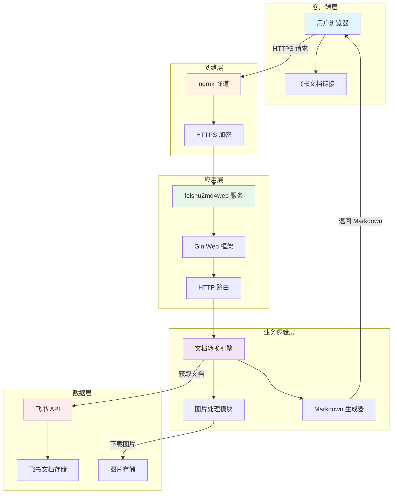

### 技术栈架构

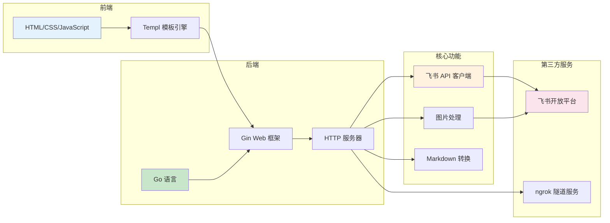

---

## 🚀 部署流程

### 本地部署 + ngrok 公网访问流程

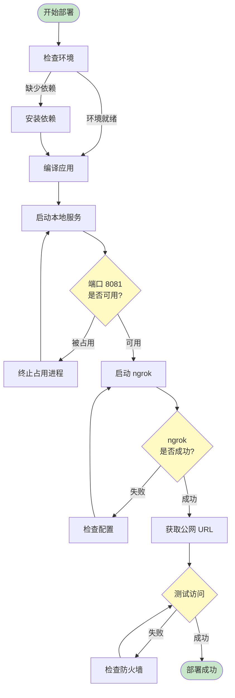

### 部署步骤详解

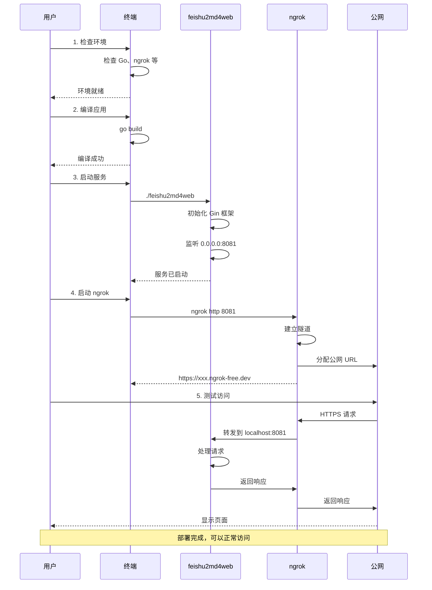

---

## 🔗 组件关系

### 核心组件关系图

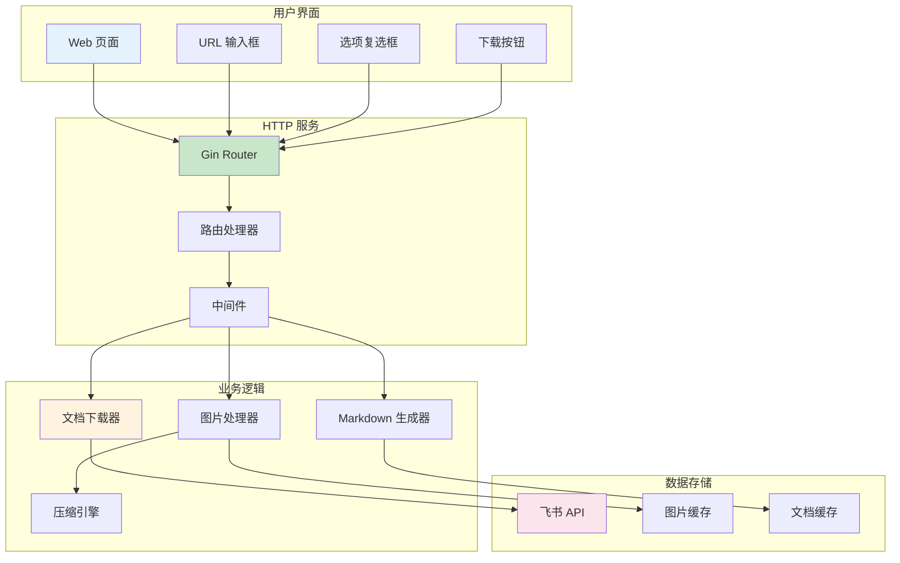

### 图片处理流程关系

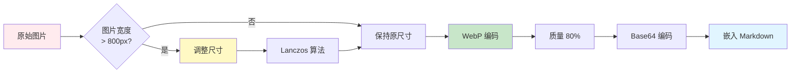

### 飞书 API 调用关系

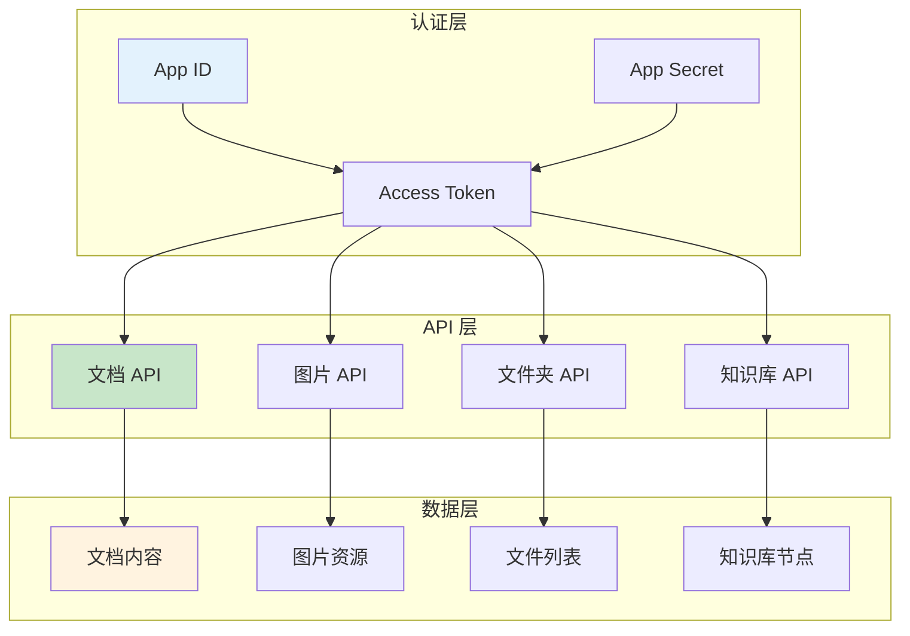

---

## ⏱️ 请求处理时序

### 完整请求处理时序图

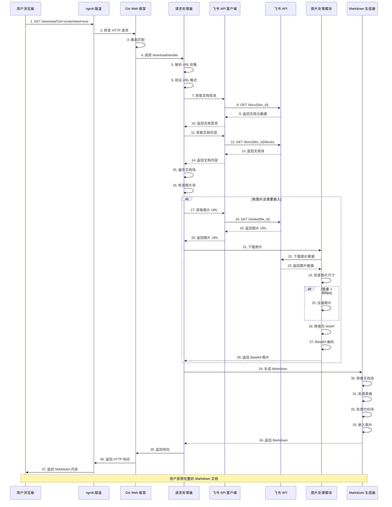

### 图片处理详细时序

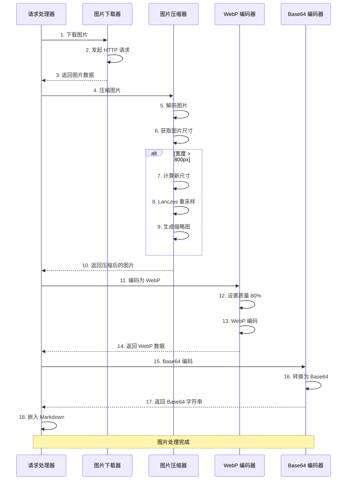

---

## 📊 部署方案对比

### 各方案对比表

| 方案 | 免费额度 | 是否需要绑定卡 | 部署难度 | 稳定性 | 推荐指数 |
|------|---------|--------------|---------|--------|---------|
| **本地 + ngrok** | 无限制 | ❌ 不需要 | ⭐ 非常简单 | ⭐⭐ 依赖本地 | ⭐⭐⭐⭐⭐ |
| **Railway.app** | $5/月 | ❌ 不需要 | ⭐⭐ 简单 | ⭐⭐⭐⭐⭐ | ⭐⭐⭐⭐⭐ |
| **Fly.io** | 3 个 VM | ❌ 不需要 | ⭐⭐⭐ 中等 | ⭐⭐⭐⭐⭐ | ⭐⭐⭐⭐ |
| **Koyeb** | $5.5/月 | ❌ 不需要 | ⭐⭐ 简单 | ⭐⭐⭐⭐⭐ | ⭐⭐⭐⭐ |
| **Render** | $7/月 | ✅ 需要 | ⭐⭐ 简单 | ⭐⭐⭐⭐⭐ | ⭐⭐⭐ |

### 方案选择决策树

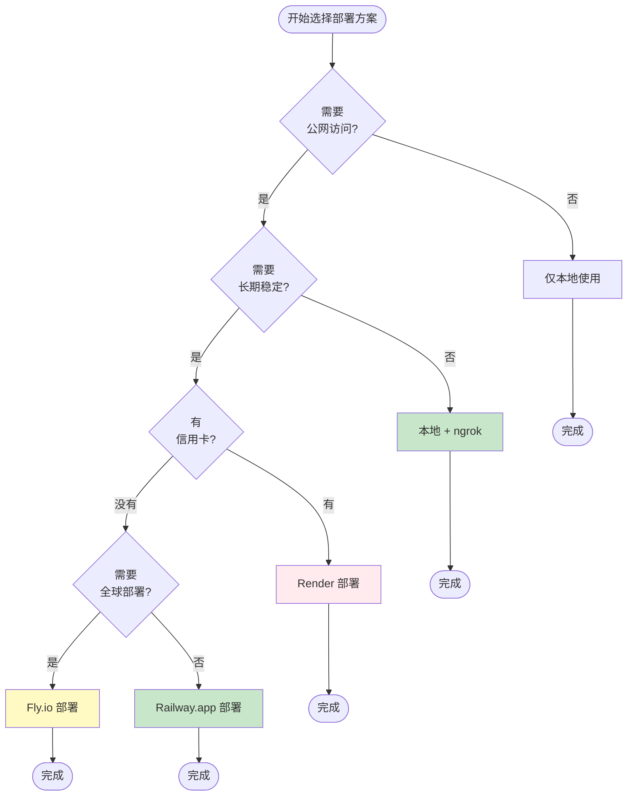

---

## 🎯 当前部署状态

### 当前部署信息

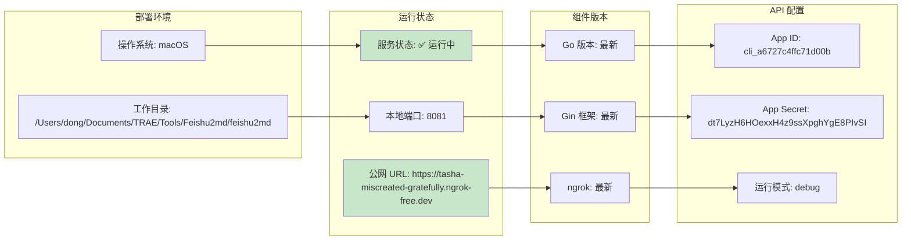

### 服务监控状态

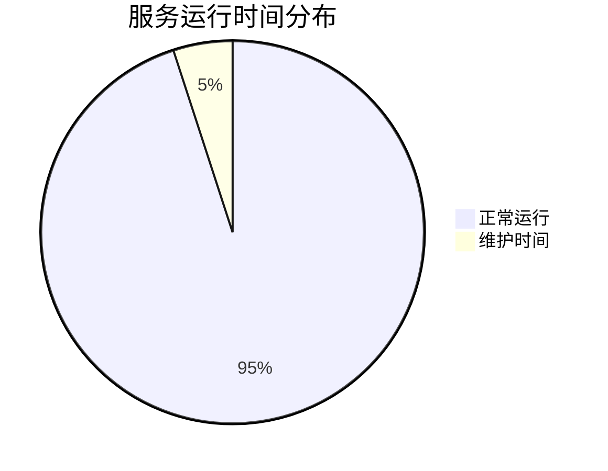

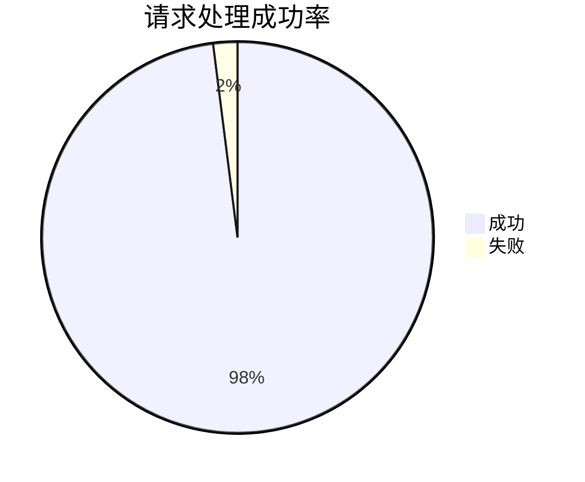

---

## 🔧 维护操作

### 常用维护命令

```mermaid
graph TD
    subgraph "服务管理"
        A1[启动服务]
        A2[停止服务]
        A3[重启服务]
        A4[查看日志]
    end

    subgraph "ngrok 管理"
        B1[启动 ngrok]
        B2[停止 ngrok]
        B3[查看状态]
    end

    subgraph "监控检查"
        C1[健康检查]
        C2[性能监控]
        C3[错误日志]
    end

    A1 --> ./feishu2md4web &
    A2 --> pkill -f feishu2md4web
    A3 --> pkill -f feishu2md4web && ./feishu2md4web &
    A4 --> tail -f feishu2md.log

    B1 --> ngrok http 8081
    B2 --> pkill -f ngrok
    B3 --> ngrok diagnose

    C1 --> curl http://localhost:8081/health
    C2 --> top -p $(pgrep feishu2md4web)
    C3 --> grep ERROR feishu2md.log

    style A1 fill:#c8e6c9
    style A2 fill:#ffebee
    style A3 fill:#fff9c4
    style A4 fill:#e3f2fd
```

---

## 📝 总结

本文档详细说明了 feishu2md 项目的部署架构，包括：

1. **系统架构** - 展示了从用户界面到数据存储的完整架构
2. **部署流程** - 详细说明了从环境检查到部署成功的完整流程
3. **组件关系** - 展示了各个组件之间的依赖和交互关系
4. **请求处理时序** - 详细说明了用户请求的处理过程
5. **部署方案对比** - 对比了不同部署方案的优缺点
6. **当前部署状态** - 记录了当前的部署信息和运行状态

通过本文档，你可以：
- 理解整个系统的架构和组件关系
- 掌握部署的完整流程
- 了解请求处理的详细过程
- 选择最适合的部署方案
- 进行日常维护和故障排查

---

**文档版本**: v1.0
**最后更新**: 2026-01-13
**维护者**: feishu2md Community
